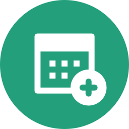

# Calendar Links plugin for Craft CMS 3.x

Generate add to calendar links for Google, iCal and other calendar systems



## Requirements

This plugin requires Craft CMS 3.0.0-beta.23 or later.

## Installation

To install the plugin, follow these instructions.

1. Open your terminal and go to your Craft project:

        cd /path/to/project

2. Then tell Composer to load the plugin:

        composer require superbig/craft3-calendarlinks

3. In the Control Panel, go to Settings → Plugins and click the “Install” button for Calendar Links.

## Using Calendar Links

```twig


{# You can add a description #}


{# And a address #}


<a href="{{ link.ics() }}">Ical</a>
<a href="{{ link.google() }}">Google</a>
<a href="{{ link.yahoo() }}">Yahoo</a>
```

## IE/Edge compatbility

IE/Edge do not support data:text/calendar URIs (see https://caniuse.com/#feat=datauri).

Use something like this as a workaround, adapted from https://docs.microsoft.com/en-us/previous-versions/windows/internet-explorer/ie-developer/samples/hh779016(v=vs.85)

In your twig file:

```html
 

<a href="{{ addToCalendarLink.ics() }}" class="download-event">Download event</a>



(function () {

    this.EventHandler = function (linkData, fileData) {
        this.linkData = linkData;
        var links = document.querySelectorAll('.download-event'), i;
        for (i = 0; i < links.length; ++i) {
            links[i].addEventListener("click", getIcs.bind(this, event));
        }
    }

    function isIE() {
        return (window.Blob && window.navigator.msSaveOrOpenBlob);
    }

    function getIcs() {
        if (isIE()) {
            var fileData = [this.linkData.split("%0A").join("\n").replace('data:text/calendar;charset=utf8,\n', '')];
            window.navigator.msSaveOrOpenBlob(new Blob(fileData), 'event.ics');
        } else {
            window.location.href = this.linkData;
        }
        event.preventDefault();
    }
}());

new EventHandler("{{ addToCalendarLink.ics() }}");


```

## Credits

[Add calendar icon by Ben Davis](https://thenounproject.com/term/add-calendar/770071)

Brought to you by [Superbig](https://superbig.co)
